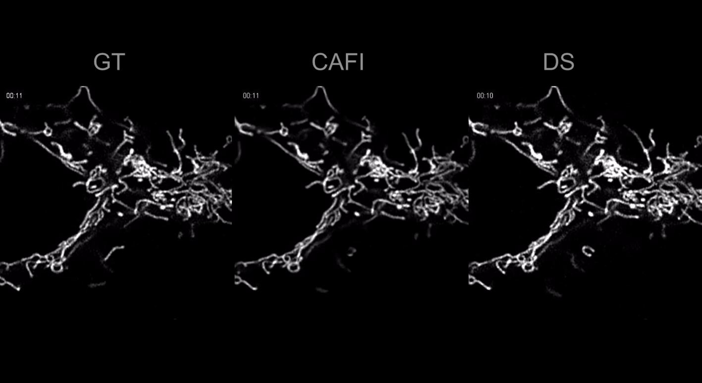
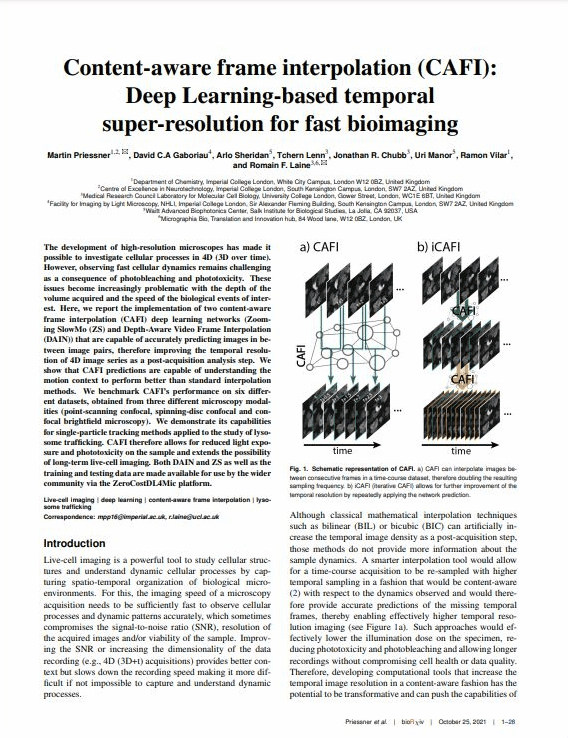

# Content-aware frame interpolation (CAFI): Deep Learning-based temporal super-resolution for fast bioimaging

Here we provide the modifide repositories of DAIN and Zooming SlowMo used in the CAFI 4 Microscopy Google Colab notebooks.

These notebooks allow the user to interpolate images between two consecutive images of a microscopy image sequence effectively increasing the temporal sampling of your dataset.

For more details see google colab notebooks:
Link to the paper: ...

 DAIN 4 Microscopy:
 
 [Original Github of DAIN](https://github.com/baowenbo/DAIN) 

 
 ZoomingSlowMo 4 Microscopy
 
 [Original Github of ZS](https://github.com/Mukosame/Zooming-Slow-Mo-CVPR-2020) 

A demonstration video is provided here:

Microscopy training and test data is available here:
https://zenodo.org/record/5596603#.YX-bKGDMIdU

<table>
  <thead>
    <tr>
      <td>Input&nbsp;&nbsp;&nbsp;&nbsp;</td>
      <td>Output</td>
    </tr>
  </thead>
  <tr>
    <td colspan="1">
      <a href="https://youtu.be/8mgD8JxBOus">
        
        </img>
      </a>
    </td>
  </tr>
</table>
