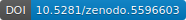

# Content-aware frame interpolation (CAFI): Deep Learning-based temporal super-resolution for fast bioimaging

Link to the paper: WILL BE ADDED SOON

## What is this?
Content-aware frame interpolation (CAFI) provides a Deep Learning-based temporal super-resolution for fast bioimaging. It increases the frame rate of any microscope modality by interpolating an image in between two consecutive images via “intelligent” interpolation, providing a 2x increase in temporal or/and axial resolution. Here we provide the modified repositories of DAIN and Zooming SlowMo used in the CAFI 4 Microscopy Google Colab notebooks.

<table>
  <tr>
    <td colspan="1">
        
        </img>
      </a>
    </td>
  </tr>
</table>

## Want to see a short video demonstration and user tutorials?

| Demonstration Video | Tutorial Video CAFI (DAIN) | Tutorial Video CAFI (ZS) |
|:-:|:-:|:-:|
|  |  |  |

## Links to the notebooks and other sources

 DAIN 4 Microscopy:
  | 
 
 [Original Github of DAIN](https://github.com/baowenbo/DAIN) | 
 [Source Paper 1](https://arxiv.org/abs/1904.00830)

 
 ZoomingSlowMo 4 Microscopy
  | 

 [Original Github of ZS](https://github.com/Mukosame/Zooming-Slow-Mo-CVPR-2020) | 
 [Source Paper 1](https://arxiv.org/abs/2002.11616#) | 
 [Source Paper 2](https://arxiv.org/abs/2104.07473#) 

Microscopy training and test data is available here:

## How to cite this work
Martin Priessner, David C.A Gaboriau, Arlo Sheridan, Tchern Lenn, Jonathan R. Chubb, Uri Manor, Ramon Vilar,
and Romain F. Laine

**Content-aware frame interpolation (CAFI): Deep Learning-based temporal super-resolution for fast bioimaging. bioRxiv, 2021.** 
DOI: [DOI](www.google.at)

<table>
  <tr>
    <td colspan="1">
        
        </img>
      </a>
    </td>
  </tr>
</table>
